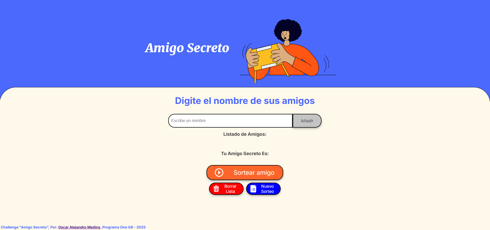

##### Curso de: Practicando Lógica de Programación
# Challenge "Amigo Secreto" 
### Proyecto de Oscar Alejandro Medina, Programa One G8 - 2025

### El Proyecto:

Se completaron todos los requerimientos del desafio, y se agregaron alguna nuevas funcionalidades adicionales que no estaba en la consigna pero que mejoran el proyecto como ser :

### Funcionalidades Agregadas
- Se agrego un nuevo boton que permite borrar la lista de Amigos añadidos por si nos equivocamos al agregar un nombre, este boton solo borra la lista de amigos a sortear, pero no elimina el amigo sorteado en el caso que ya hayamos sorteado uno.

- Se agrego un nuevo boton que permite borrar todas las listas, incluidos los amigos sorteados y poner todo en blanco, para permitirnos empezar de nuevo sin contenido).

- Se agrego a la funcion del boton agregar amigo, una logica que chequea si el amigo agregado ya se encuentra en la lista de amigos, y de ser asi, no permite agregar amigos repetidos, alertando al usuario de que el amigo ya esta en la lista. Tambien controla que no se agregen nombres vacios en el array, y alerta al usuario de que no se pueden agregar espacios vacios.

- Se agrego a la funcion de sorteo de amigo, una logica que determina si el amigo sorteado ya se encuentra sorteado previamente, y de ser asi no lo sortea dos veces seguidas, sino que sortea otro amigo de la lista. En el caso de no quedar amigos que sortear, alertara al usuario de que todos los amigos han sido sorteados.

##### Puedes Visitar el Proyecto online en Githeb Pages mediante el siguiente enlace:
# [Challenge Amigo Secrero](https://alejandromedina-ar.github.io/Challenge_Amigo_Secreto_One-G8)  

  
Programado por: [Oscar Alejandro Medina](https://www.linkedin.com/in/oscar-alejandro-medina-ar)

